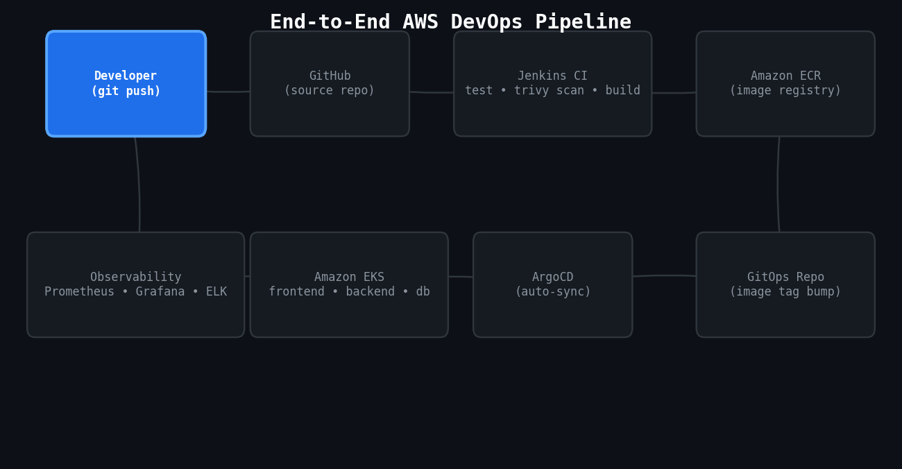

# End-to-End AWS DevOps Project — Cloud-Native Application Deployment

Production-ready, end-to-end cloud-native deployment pipeline on AWS. This project takes an application from a laptop to a highly available production platform: automated infrastructure with **Terraform**, immutable images built and scanned in **Jenkins CI**, GitOps delivery with **ArgoCD** on **Amazon EKS**, and full-stack observability with **Prometheus/Grafana** and the **ELK stack**.

> 📖 Full step-by-step write-up: [End-to-End AWS DevOps Project: Cloud-Native Application Deployment](https://www.linkedin.com/pulse/end-to-end-aws-devops-project-cloud-native-deployment-gaurav-khatri-otncf/) by **Gaurav Khatri**

## Architecture

```
Developer → GitHub → Jenkins CI (test, Trivy scan, build) → Amazon ECR
                                                                 │
                                                                 ▼
                                            GitOps repo (image tag bump)
                                                                 │
                                                                 ▼
                                    ArgoCD (auto-sync) → Amazon EKS (frontend / backend / database namespaces)
                                                                 │
                              ┌──────────────────────────────────┼──────────────────────────────────┐
                              ▼                                  ▼                                  ▼
                     Route53 + CloudFront + WAF          Multi-AZ RDS PostgreSQL + S3         Prometheus/Grafana + ELK
```

## Pipeline flow



An [MP4 version](docs/pipeline-flow.mp4) of this flow diagram is also included in `docs/`.

## Tech stack

| Layer | Tools |
|---|---|
| Infrastructure as Code | Terraform (VPC, EKS, RDS, S3, IAM) |
| Configuration management | Ansible |
| Compute / Orchestration | Amazon EKS (Kubernetes 1.29) |
| CI | Jenkins, Trivy (container security scanning) |
| Image registry | Amazon ECR |
| CD / GitOps | ArgoCD |
| Edge & networking | Route 53, CloudFront, AWS WAF, ACM |
| Data & storage | Amazon RDS (Multi-AZ PostgreSQL), Amazon S3 |
| Observability | Prometheus, Grafana, ELK (Elasticsearch, Logstash/Fluentbit, Kibana) |
| DR | Multi-region active/standby, Route 53 health checks (RTO < 15m, RPO < 5m) |

## Repository layout

```
.
├── terraform/          # VPC, EKS cluster, Jenkins EC2, RDS + S3 (remote state in S3 + DynamoDB)
├── ansible/             # Playbook to provision the Jenkins CI VM (Docker, Java, Jenkins)
├── docker/              # Multi-stage, non-root production Dockerfile
├── jenkins/             # Jenkinsfile — test, scan, build, push to ECR, bump GitOps repo
├── k8s/                 # ArgoCD Application manifest (GitOps entry point)
└── README.md
```

## How it works, end to end

1. **Local setup** — Terraform, AWS CLI, kubectl, Helm and Ansible are installed locally; Terraform state is stored remotely in S3 with DynamoDB locking so multiple engineers can work safely against the same infrastructure.
2. **Network & CI host** — Terraform provisions a highly available multi-AZ VPC and an EC2 instance for Jenkins; Ansible then configures that instance with Docker and Jenkins.
3. **Kubernetes** — Terraform provisions an Amazon EKS cluster with managed node groups, and isolated namespaces are created for `frontend`, `backend` and `database` workloads.
4. **CI** — On every push, Jenkins runs unit tests, builds a multi-stage Docker image, scans it with Trivy, and pushes it to Amazon ECR.
5. **GitOps handoff** — Jenkins updates the image tag in a separate GitOps repository rather than deploying directly.
6. **CD** — ArgoCD watches the GitOps repository and automatically syncs the new image into the EKS cluster (with self-heal and pruning enabled).
7. **Edge & data** — Route 53, CloudFront, AWS WAF and ACM handle secure public traffic; a Multi-AZ RDS PostgreSQL instance and S3 handle persistence.
8. **Observability & DR** — Prometheus and Grafana track cluster and application metrics, the ELK stack centralizes logs, and a multi-region active/standby setup provides disaster recovery.

## Notes

The Terraform, Ansible, Jenkins and Kubernetes manifests in this repo are reference implementations extracted from the write-up above — replace account IDs, domain names, CIDR ranges and instance sizes with your own before using them against a real AWS account.

---

**Author:** [Gaurav Khatri](https://www.linkedin.com/in/gaurav-khatri-devops/) — DevOps Engineer @ Sarv.com | Kubernetes (EKS), Docker, GitOps & CI/CD
